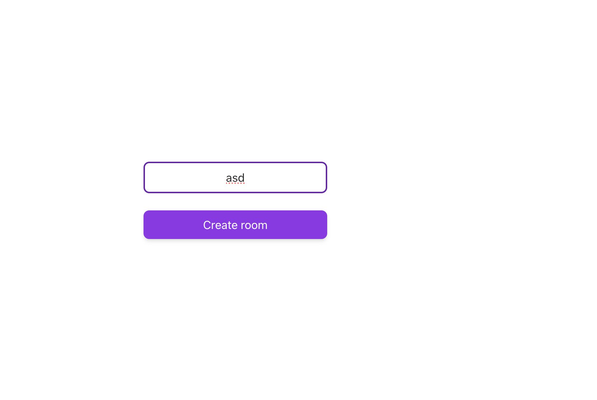
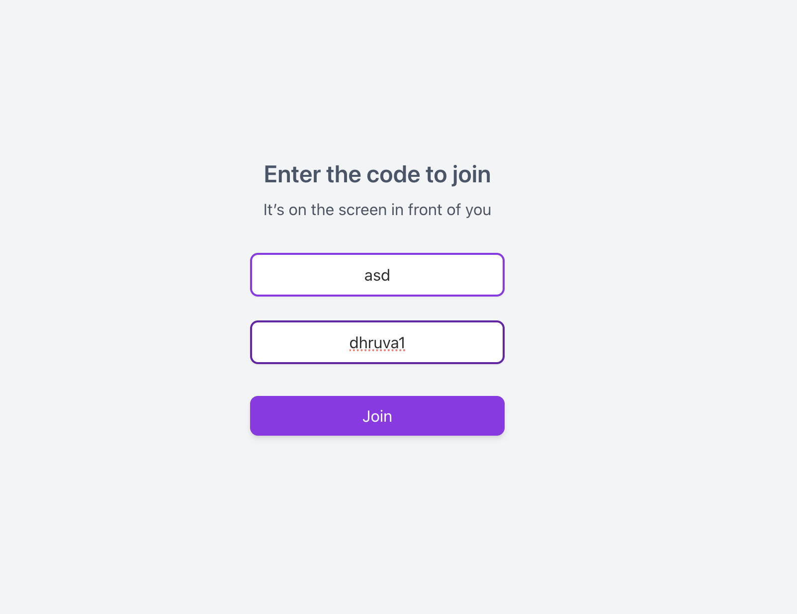
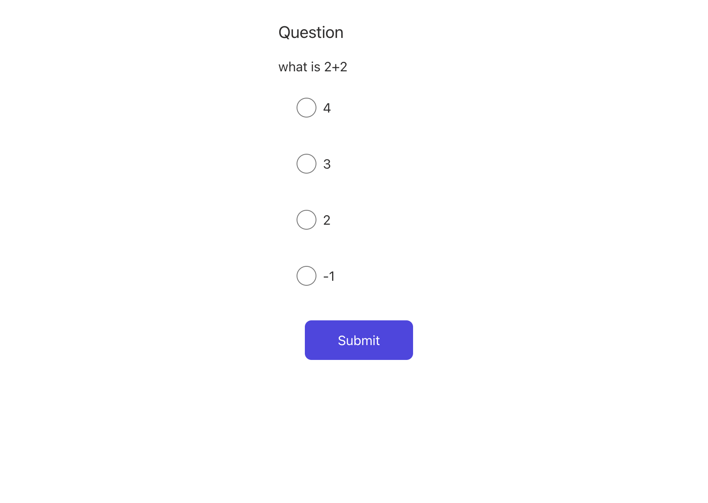
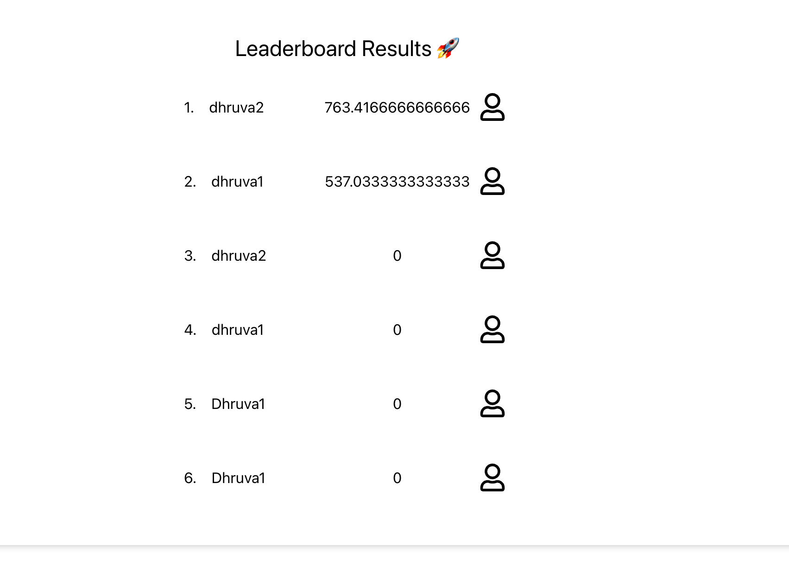

# Real-Time Quiz App

Welcome to the Real-Time Quiz App! This project is designed to facilitate real-time quizzes with both user and admin functionalities. The application is split into frontend and backend components.

## Frontend

The frontend is built using React with Vite and TypeScript. It utilizes the Socket.IO client to handle real-time communication. Below are key features and components of the frontend:

### Key Features:

- **Real-Time Updates:** Utilizes Socket.IO for real-time communication between the server and clients.
- **User and Admin Events:** Implements distinct events for user and admin interactions.
- **React and Vite:** Built with React and powered by Vite for a fast and efficient development experience.

### Folder Structure:

```plaintext
frontend
|-- src
|   |-- components --> All the components are written
|   |-- App.tsx
```

### Screenshots:

## Admin


## User


## Question


## LeaderBoard



## Backend

The backend is developed in TypeScript and uses Socket.IO for real-time communication. Here's an overview of the backend components:

### Key Features:

- **Socket.IO Integration:** Leverages Socket.IO for handling real-time events and communication.
- **Managers:** Utilizes various managers for handling different aspects like user management, admin actions, quiz management, etc.

### Folder Structure:

```plaintext
backend
|-- src
|   |-- Managers
|   |   |-- AdminManager.ts
|   |   |-- UserManager.ts
|   |   |-- QuizManager.ts
|   |   |-- IoManager.ts
|   |-- Quiz.ts
|   |-- index.ts
```


## Getting Started

To run the Real-Time Quiz App locally, follow these steps:

1. **Clone the Repository:**
   ```bash
   git clone https://github.com/your-username/real-time-quiz-app.git
   cd real-time-quiz-app
   ```

2. **Install Dependencies:**
   ```bash
   # Install frontend dependencies
   cd frontend
   npm install

   # Install backend dependencies
   cd ../backend
   npm install
   ```

3. **Run the App:**
   ```bash
   # Run frontend
   cd ../frontend
   npm run dev

   # Run backend
   cd ../backend
   npx tsc -b
   node .dist/index.js
   ```
